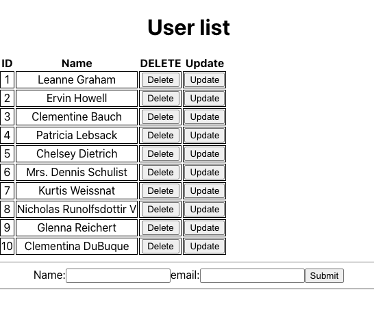

# RESTful demo with fetch API

```js
useEffect(()=>{}, [])
// Method #1 - Use .then
fetch(url).then(response=>{}).then(data=>{}).catch(error=>{})
======
fetch(url) -> response
!response.ok -> new Error()
response.json() -> data
=====
// Method #2 - Use async/await
const getData = async() =>{try().catch().finally()}
const response = await fetch(url)
const data = await response.json()
```

- [UsersView.js](./src/features/users/UsersView.jsx)
  

## GET

```js
export const UsersView = () => {
  const [users, setUsers] = useState([]);
  const [loading, setLoading] = useState(true);
  const [error, setError] = useState(null);

  useEffect(() => {
    fetch(url)
      .then((response) => {
        if (!response.ok) throw new Error("");
        return response.json();
      })
      .then((data) => {
        setUsers(data);
        setLoading(false);
      })
      .catch((e) => {
        setError(e);
      });
  }, []);
};
```

## POST

```js
export const UsersView = () => {
  const [users, setUsers] = useState([]);
  const [loading, setLoading] = useState(true);
  const [error, setError] = useState(null);
  const [name, setName] = useState("");
  const [email, setEmail] = useState("");

  const handleSubmit = async (event) => {
    event.preventDefault();
    fetch("https://jsonplaceholder.typicode.com/users", {
      method: "POST",
      headers: {
        "Content-Type": "application/json",
      },
      body: JSON.stringify({ name, email }),
    })
      .then((response) => response.json())
      .then((data) => {
        setUsers([...users, data]);
        setName("");
        setEmail("");
      })
      .catch((error) => {
        setError(error);
      });
  };
};
```

## DELETE

```js
const handleDelete = (id) => {
  fetch(`https://jsonplaceholder.typicode.com/users/${id}`, {
    method: "DELETE",
  })
    .then((response) => {
      if (!response.ok) throw new Error("");
      return response.json();
    })
    .then((data) => {
      setMessage("Item deleted successfully:");
      setUsers((values) => {
        return values.filter((item) => item.id !== id);
      });
      console.log(data);
      setLoading(false);
    })
    .catch((e) => {
      setError(e);
    });
};
```

### Render nested array of objects

```js
onst data = [
  {
    id: 1,
    name: "Category 1",
    items: [
      { id: 101, name: "Item 1.1" },
      { id: 102, name: "Item 1.2" },
    ],
  },
  {
    id: 2,
    name: "Category 2",
    items: [
      { id: 201, name: "Item 2.1" },
      { id: 202, name: "Item 2.2" },
      { id: 203, name: "Item 2.3" },
    ],
  },
];
export const DemoView = () => {
  return (
    <div>
    </div>
  );
};
```

**Q1:A**

- Warning: "JSX must have one parent element"

```js
return (
  <>
    <div>node1</div>
    <div>node2</div>
  </>
);
```

```js
export const DemoView = () => {
  return (
    <div> ## <====A outer div of the first map().
      {data.map((category) => (
        <div key={category.id}>## <====A innter div of the 2nd map().
          <h3>{category.name}</h3>
          <ul> ## <====A outer div of the map().
            {category.items.map((item) => (
              <li key={item.id}>{item.id}</li> ## <====A innter div of the map().
            ))}
          </ul>
        </div>
      ))}
    </div>
  );
};
```

## Custom Hook - useFetch

```js
import { useState, useEffect } from "react";

function useFetch(url, options) {
  const [data, setData] = useState(null);
  const [loading, setLoading] = useState(true);
  const [error, setError] = useState(null);

  useEffect(() => {
    setLoading(true);
    fetch(url, options)
      .then((response) => {
        if (!response.ok) {
          throw new Error(`HTTP error! status: ${response.status}`);
        }
        const data = response.json();
        return data;
      })
      .then((data) => {
        setData(data);
      })
      .catch((error) => {
        console.log(error);
        setError(error);
      });
    setLoading(false);
  }, [url]);
  return { data, loading, error };
}
export default useFetch;
```

## References:

- https://stackoverflow.com/questions/62613709/implement-usefetch-react-hook-to-work-inside-submit-function
